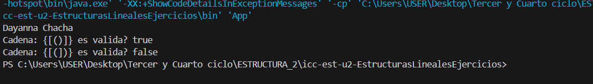
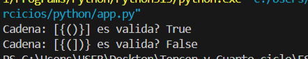
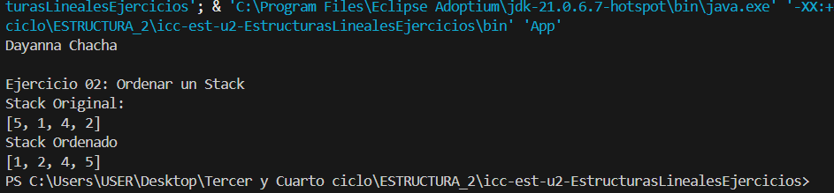
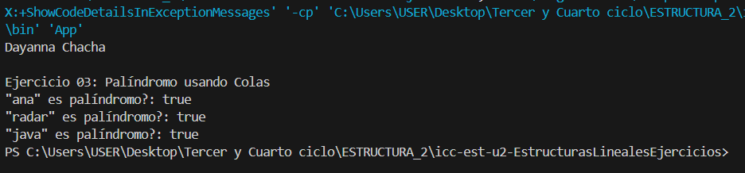

# Estructura de datos 

**Estudiante:** Janelly Dayanna Chacha Velez

## Estructuras Lineales Ejercicios

### Ejercicio 1 Clases Validar Signos- 15/Dic/2025
### Java

### Phyton 

##
### Ejercicio 2 Casa Ordenar un Stack- 15/Dic/2025
### Java

##
### Ejercicio 3 Casa Palíndromo usando Colas - 15/Dic/2025
### Java
